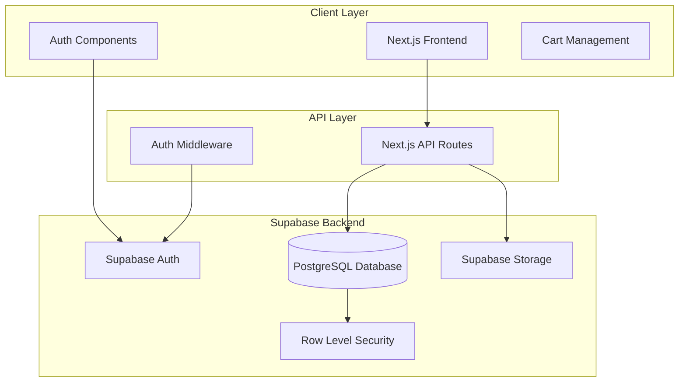

# Design Document: LensaNusantara E-commerce Platform

## Overview

LensaNusantara is a modern e-commerce platform built with Next.js App Router, Tailwind CSS, and Supabase backend. The system implements role-based access control with distinct user and admin experiences, focusing on photography equipment sales with secure authentication, product management, and order processing.

The architecture follows a client-server model where Next.js handles the frontend and API routes, while Supabase provides authentication, database, and file storage services. The system emphasizes security through Row Level Security (RLS) policies and role-based access control.

## Architecture

### System Architecture



### Technology Stack

- **Frontend Framework**: Next.js 14+ with App Router
- **Styling**: Tailwind CSS for responsive design
- **Backend**: Supabase (PostgreSQL, Auth, Storage)
- **Authentication**: Supabase Auth with custom role management
- **File Storage**: Supabase Storage for product images
- **Security**: Row Level Security (RLS) policies

### Deployment Architecture

- **Frontend**: Vercel or similar Next.js hosting platform
- **Backend**: Supabase cloud infrastructure
- **CDN**: Automatic through Supabase Storage for images
- **Environment**: Separate development and production Supabase projects

## Components and Interfaces

### Authentication System

**Supabase Auth Integration**:
- Extends default Supabase auth.users table with role field
- Custom middleware for role-based route protection
- Session management with role persistence
- Secure logout and session cleanup

**Auth Components**:
```typescript
interface AuthUser {
  id: string;
  email: string;
  role: 'user' | 'admin';
  created_at: string;
}

interface AuthContext {
  user: AuthUser | null;
  loading: boolean;
  signIn: (email: string, password: string) => Promise<void>;
  signUp: (email: string, password: string) => Promise<void>;
  signOut: () => Promise<void>;
}
```

### Product Management System

**Product Interface**:
```typescript
interface Product {
  id: string;
  name: string;
  category: string;
  description: string;
  price: number;
  stock: number;
  image_url: string;
  created_at: string;
  updated_at: string;
}
```

**Product Service**:
- CRUD operations with RLS enforcement
- Image upload integration with Supabase Storage
- Stock management and validation
- Category-based filtering and search

### Shopping Cart System

**Cart Interface**:
```typescript
interface CartItem {
  product_id: string;
  product: Product;
  quantity: number;
}

interface Cart {
  items: CartItem[];
  total: number;
  itemCount: number;
}
```

**Cart Management**:
- Session-based cart storage
- Real-time stock validation
- Quantity updates with availability checks
- Cart persistence during user session

### Order Processing System

**Order Interfaces**:
```typescript
interface Order {
  id: string;
  user_id: string;
  total_amount: number;
  status: 'pending' | 'confirmed' | 'shipped' | 'delivered';
  created_at: string;
}

interface OrderItem {
  id: string;
  order_id: string;
  product_id: string;
  quantity: number;
  price_at_purchase: number;
}
```

**Order Processing Flow**:
1. Cart validation and stock verification
2. Order creation with transaction handling
3. Order items generation with price snapshot
4. Stock deduction and cart clearing
5. Order confirmation and status tracking

### Admin Dashboard System

**Admin Components**:
- Protected route middleware for admin access
- Product management interface (CRUD operations)
- Order monitoring and status management
- Image upload with Supabase Storage integration
- Analytics and reporting dashboard

**Admin Services**:
- Role verification middleware
- Bulk product operations
- Order status updates
- User management capabilities

## Data Models

### Database Schema

**Extended Users Table** (extends auth.users):
```sql
CREATE TABLE public.user_profiles (
  id UUID REFERENCES auth.users(id) PRIMARY KEY,
  role TEXT NOT NULL DEFAULT 'user' CHECK (role IN ('user', 'admin')),
  created_at TIMESTAMP WITH TIME ZONE DEFAULT NOW(),
  updated_at TIMESTAMP WITH TIME ZONE DEFAULT NOW()
);
```

**Products Table**:
```sql
CREATE TABLE public.products (
  id UUID DEFAULT gen_random_uuid() PRIMARY KEY,
  name TEXT NOT NULL,
  category TEXT NOT NULL,
  description TEXT,
  price DECIMAL(10,2) NOT NULL CHECK (price >= 0),
  stock INTEGER NOT NULL DEFAULT 0 CHECK (stock >= 0),
  image_url TEXT,
  created_at TIMESTAMP WITH TIME ZONE DEFAULT NOW(),
  updated_at TIMESTAMP WITH TIME ZONE DEFAULT NOW()
);
```

**Orders Table**:
```sql
CREATE TABLE public.orders (
  id UUID DEFAULT gen_random_uuid() PRIMARY KEY,
  user_id UUID REFERENCES auth.users(id) NOT NULL,
  total_amount DECIMAL(10,2) NOT NULL CHECK (total_amount >= 0),
  status TEXT NOT NULL DEFAULT 'pending' CHECK (status IN ('pending', 'confirmed', 'shipped', 'delivered')),
  created_at TIMESTAMP WITH TIME ZONE DEFAULT NOW(),
  updated_at TIMESTAMP WITH TIME ZONE DEFAULT NOW()
);
```

**Order Items Table**:
```sql
CREATE TABLE public.order_items (
  id UUID DEFAULT gen_random_uuid() PRIMARY KEY,
  order_id UUID REFERENCES public.orders(id) ON DELETE CASCADE NOT NULL,
  product_id UUID REFERENCES public.products(id) NOT NULL,
  quantity INTEGER NOT NULL CHECK (quantity > 0),
  price_at_purchase DECIMAL(10,2) NOT NULL CHECK (price_at_purchase >= 0),
  created_at TIMESTAMP WITH TIME ZONE DEFAULT NOW()
);
```

### Row Level Security Policies

**User Profiles RLS**:
```sql
-- Users can read their own profile
CREATE POLICY "Users can read own profile" ON public.user_profiles
  FOR SELECT USING (auth.uid() = id);

-- Admins can read all profiles
CREATE POLICY "Admins can read all profiles" ON public.user_profiles
  FOR SELECT USING (
    EXISTS (
      SELECT 1 FROM public.user_profiles 
      WHERE id = auth.uid() AND role = 'admin'
    )
  );
```

**Products RLS**:
```sql
-- Everyone can read products
CREATE POLICY "Everyone can read products" ON public.products
  FOR SELECT USING (true);

-- Only admins can modify products
CREATE POLICY "Admins can modify products" ON public.products
  FOR ALL USING (
    EXISTS (
      SELECT 1 FROM public.user_profiles 
      WHERE id = auth.uid() AND role = 'admin'
    )
  );
```

**Orders RLS**:
```sql
-- Users can read their own orders
CREATE POLICY "Users can read own orders" ON public.orders
  FOR SELECT USING (auth.uid() = user_id);

-- Admins can read all orders
CREATE POLICY "Admins can read all orders" ON public.orders
  FOR SELECT USING (
    EXISTS (
      SELECT 1 FROM public.user_profiles 
      WHERE id = auth.uid() AND role = 'admin'
    )
  );
```

### Supabase Storage Configuration

**Product Images Bucket**:
- Bucket name: `product-images`
- Public access: Read-only for authenticated users
- Upload permissions: Admin users only
- File size limit: 5MB per image
- Allowed formats: JPEG, PNG, WebP

**Storage Policies**:
```sql
-- Anyone can view product images
CREATE POLICY "Public read access" ON storage.objects
  FOR SELECT USING (bucket_id = 'product-images');

-- Only admins can upload images
CREATE POLICY "Admin upload access" ON storage.objects
  FOR INSERT WITH CHECK (
    bucket_id = 'product-images' AND
    EXISTS (
      SELECT 1 FROM public.user_profiles 
      WHERE id = auth.uid() AND role = 'admin'
    )
  );
```

## Supabase Backend Setup Process

### Step 1: Supabase Project Creation

1. **Create Supabase Account and Project**:
   - Visit [supabase.com](https://supabase.com) and create account
   - Create new project with desired name and region
   - Note down project URL and anon key from Settings > API

2. **Environment Configuration**:
   ```env
   NEXT_PUBLIC_SUPABASE_URL=your_project_url
   NEXT_PUBLIC_SUPABASE_ANON_KEY=your_anon_key
   SUPABASE_SERVICE_ROLE_KEY=your_service_role_key
   ```

### Step 2: Database Schema Setup

1. **Execute Schema Creation Scripts**:
   - Run user_profiles table creation
   - Run products table creation
   - Run orders and order_items table creation
   - Set up foreign key relationships

2. **Enable Row Level Security**:
   ```sql
   ALTER TABLE public.user_profiles ENABLE ROW LEVEL SECURITY;
   ALTER TABLE public.products ENABLE ROW LEVEL SECURITY;
   ALTER TABLE public.orders ENABLE ROW LEVEL SECURITY;
   ALTER TABLE public.order_items ENABLE ROW LEVEL SECURITY;
   ```

3. **Create RLS Policies**:
   - Implement user profile access policies
   - Set up product read/write policies
   - Configure order access policies
   - Create order items policies

### Step 3: Authentication Configuration

1. **Configure Auth Settings**:
   - Enable email/password authentication
   - Set up email templates (optional)
   - Configure redirect URLs for development/production

2. **Create Auth Triggers**:
   ```sql
   -- Trigger to create user profile on signup
   CREATE OR REPLACE FUNCTION public.handle_new_user()
   RETURNS TRIGGER AS $$
   BEGIN
     INSERT INTO public.user_profiles (id, role)
     VALUES (NEW.id, 'user');
     RETURN NEW;
   END;
   $$ LANGUAGE plpgsql SECURITY DEFINER;

   CREATE TRIGGER on_auth_user_created
     AFTER INSERT ON auth.users
     FOR EACH ROW EXECUTE FUNCTION public.handle_new_user();
   ```

### Step 4: Storage Setup

1. **Create Storage Bucket**:
   - Create `product-images` bucket in Supabase Storage
   - Configure bucket as public for read access
   - Set file size limits and allowed file types

2. **Configure Storage Policies**:
   - Set up public read access for product images
   - Restrict upload access to admin users only
   - Configure automatic image optimization (optional)

### Step 5: API Functions (Optional)

1. **Create Database Functions**:
   ```sql
   -- Function to get user role
   CREATE OR REPLACE FUNCTION get_user_role(user_uuid UUID)
   RETURNS TEXT AS $$
   BEGIN
     RETURN (
       SELECT role FROM public.user_profiles 
       WHERE id = user_uuid
     );
   END;
   $$ LANGUAGE plpgsql SECURITY DEFINER;
   ```

2. **Create Edge Functions** (if needed):
   - Order processing functions
   - Email notification functions
   - Payment processing hooks

### Step 6: Development Data Setup

1. **Create Admin User**:
   ```sql
   -- Update a user to admin role (replace with actual user ID)
   UPDATE public.user_profiles 
   SET role = 'admin' 
   WHERE id = 'user_uuid_here';
   ```

2. **Seed Sample Products**:
   ```sql
   INSERT INTO public.products (name, category, description, price, stock) VALUES
   ('Canon EOS R5', 'Camera', 'Professional mirrorless camera', 3899.99, 10),
   ('Sony FE 24-70mm f/2.8', 'Lens', 'Professional zoom lens', 2199.99, 5),
   ('Manfrotto Carbon Tripod', 'Accessory', 'Lightweight carbon fiber tripod', 599.99, 15);
   ```

## Correctness Properties

*A property is a characteristic or behavior that should hold true across all valid executions of a system—essentially, a formal statement about what the system should do. Properties serve as the bridge between human-readable specifications and machine-verifiable correctness guarantees.*

Now I'll analyze the acceptance criteria to determine which ones are testable as properties:

<function_calls>
<invoke name="prework">
<parameter name="featureName">lensa-nusantara

After reviewing the prework analysis, I'll consolidate redundant properties and create comprehensive correctness properties:

**Property Reflection:**
- Authentication properties (1.1-1.5) can be consolidated into comprehensive auth behavior properties
- Role-based access properties (2.1-2.5) can be combined into access control properties  
- Product display properties (3.1-3.5, 4.1-4.5) can be consolidated into product behavior properties
- Cart management properties (5.1-5.5) can be combined into cart operation properties
- Order processing properties (6.1-6.5) can be consolidated into order lifecycle properties
- Admin management properties (7.1-7.5, 8.1-8.5) can be combined into admin operation properties
- Security and file upload properties (10.2-10.5, 11.1-11.5) can be consolidated into security properties

### Property 1: User Registration and Authentication
*For any* valid email and password combination, user registration should create a new user account with default "user" role, and subsequent login with those credentials should establish an authenticated session with correct role information.
**Validates: Requirements 1.1, 1.2, 1.3**

### Property 2: Session Management and Logout
*For any* authenticated user session, logout should terminate the session completely and clear all authentication state, making protected resources inaccessible.
**Validates: Requirements 1.4, 1.5**

### Property 3: Role-Based Access Control
*For any* user with "admin" role, access to admin routes should be granted, while any user with "user" role should be denied access to admin routes and redirected appropriately.
**Validates: Requirements 2.1, 2.2, 2.4**

### Property 4: Row Level Security Enforcement
*For any* database query, the system should enforce Row Level Security policies based on the authenticated user's role, ensuring users can only access data they are authorized to see.
**Validates: Requirements 2.3, 10.2**

### Property 5: Product Catalog Display
*For any* product in the catalog, when displayed to users, it should include name, price, current stock status, and properly loaded images with appropriate error handling for missing images.
**Validates: Requirements 3.1, 3.3, 3.4, 4.1, 4.2**

### Property 6: Product Navigation and Interface
*For any* product, clicking on it should navigate to a detailed product page that provides an "Add to Cart" interface for authenticated users.
**Validates: Requirements 3.2, 4.3**

### Property 7: Real-time Product Updates
*For any* product information updated by admins, the changes should be immediately reflected for all users viewing the product catalog or detail pages.
**Validates: Requirements 4.5**

### Property 8: Cart Operations
*For any* cart operation (add, modify quantity, remove), the cart contents should update immediately with correct totals, stock validation should occur, and confirmation should be displayed to the user.
**Validates: Requirements 5.1, 5.2, 5.3, 5.4**

### Property 9: Cart Session Persistence
*For any* user session, cart contents should persist throughout the session and be completely cleared upon logout.
**Validates: Requirements 5.5**

### Property 10: Order Processing Workflow
*For any* checkout initiation, the system should validate cart contents and stock availability, create order records with correct user_id and total_amount, generate order_items with price_at_purchase snapshots, and clear the cart upon successful order confirmation.
**Validates: Requirements 6.1, 6.2, 6.3, 6.5**

### Property 11: Payment Processing Simulation
*For any* completed checkout, the system should simulate payment processing and update order status appropriately.
**Validates: Requirements 6.4**

### Property 12: Admin Product Management
*For any* admin user, the product management interface should display all products with edit/delete options, allow creation of new products with field validation, and handle product updates and deletions correctly including cart reference cleanup.
**Validates: Requirements 7.1, 7.2, 7.4, 7.5**

### Property 13: Admin Order Management
*For any* admin user, the order management interface should display all orders with customer information, provide detailed order views, allow status updates, and include filtering/search capabilities while respecting RLS policies.
**Validates: Requirements 8.1, 8.2, 8.3, 8.4, 8.5**

### Property 14: File Upload Security
*For any* file upload attempt by admin users, the system should validate file format and size constraints, store files securely in Supabase Storage with proper permissions, and handle upload errors gracefully with user feedback.
**Validates: Requirements 7.3, 10.3, 11.1, 11.2, 11.4**

### Property 15: Image Display and Cleanup
*For any* image display request, the system should generate secure URLs with appropriate access controls, and when products are deleted, associated image files should be cleaned up from storage.
**Validates: Requirements 11.3, 11.5**

### Property 16: Security Event Handling
*For any* authentication failure, session expiration, or unauthorized access attempt, the system should handle the security event appropriately while maintaining system security and providing user-friendly error messages.
**Validates: Requirements 10.4, 10.5, 12.4**

### Property 17: Database Integrity
*For any* database operation, the system should enforce referential integrity constraints and data validation rules to maintain data consistency.
**Validates: Requirements 9.5**

## Error Handling

### Authentication Errors
- Invalid credentials: Clear error messages without revealing user existence
- Session expiration: Automatic redirect to login with session restoration
- Role verification failures: Secure fallback to user role with audit logging

### Product Management Errors
- Image upload failures: Graceful degradation with retry options
- Stock validation errors: Real-time feedback with alternative suggestions
- Product not found: User-friendly 404 pages with navigation options

### Order Processing Errors
- Insufficient stock: Clear messaging with stock availability updates
- Payment simulation failures: Error recovery with cart preservation
- Database transaction failures: Rollback with user notification

### File Storage Errors
- Upload size/format violations: Immediate validation feedback
- Storage service unavailability: Fallback mechanisms and retry logic
- Image loading failures: Placeholder images with retry options

## Testing Strategy

### Dual Testing Approach

The testing strategy employs both unit tests and property-based tests to ensure comprehensive coverage:

**Unit Tests**: Focus on specific examples, edge cases, and integration points
- Authentication flow examples (valid/invalid credentials)
- Cart operations with specific products and quantities
- Order processing with known data sets
- Admin interface interactions with sample data
- Error condition handling with specific scenarios

**Property-Based Tests**: Verify universal properties across all inputs
- Generate random user credentials for authentication testing
- Create random product data for catalog operations
- Generate random cart configurations for cart management testing
- Create random order scenarios for order processing validation
- Generate random file uploads for security testing

### Property-Based Testing Configuration

**Testing Framework**: Use `@fast-check/jest` for TypeScript/JavaScript property-based testing
- Minimum 100 iterations per property test
- Each property test references its design document property
- Tag format: **Feature: lensa-nusantara, Property {number}: {property_text}**

**Test Data Generation**:
- User generators: Random emails, passwords, roles
- Product generators: Random names, categories, prices, stock levels
- Cart generators: Random product combinations and quantities
- Order generators: Random order configurations and statuses
- File generators: Random file types, sizes, and formats

**Integration with Supabase**:
- Use Supabase test database for property tests
- Reset database state between test runs
- Mock external services (email, payment simulation)
- Test RLS policies with different user contexts

### Testing Coverage Requirements

**Authentication System**: 
- Unit tests for login/logout flows
- Property tests for session management across all user types
- Security tests for unauthorized access attempts

**Product Management**:
- Unit tests for CRUD operations with specific products
- Property tests for catalog display across all product configurations
- Performance tests for image loading and storage

**Cart and Order System**:
- Unit tests for checkout flow with known scenarios
- Property tests for cart operations across all product combinations
- Integration tests for order processing workflow

**Admin Functions**:
- Unit tests for admin interface interactions
- Property tests for admin operations across all data sets
- Security tests for role-based access control

**Database and Security**:
- Unit tests for RLS policy enforcement with specific cases
- Property tests for data access across all user roles and data combinations
- Security tests for file upload validation and storage